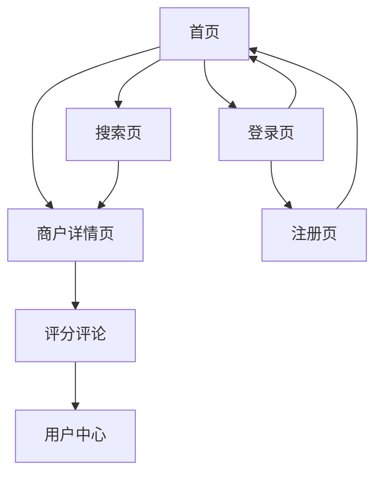

## 1. Product Overview
简化版大众点评类网站应用，提供商户信息展示、搜索和评分评论功能。帮助用户发现本地优质商户，同时为商户提供展示平台。

目标用户为寻找本地服务的消费者和希望展示业务的商户，通过用户评价系统建立信任，促进本地商业发展。

## 2. Core Features

### 2.1 User Roles
| Role | Registration Method | Core Permissions |
|------|---------------------|------------------|
| Normal User | Email/Phone registration | Browse merchants, search, rate and review, upload photos |
| Merchant Admin | Special registration with business verification | Manage merchant info, respond to reviews, upload business photos |

### 2.2 Feature Module
核心页面包括：
1. **首页**: 搜索栏、分类导航、热门商户推荐、商户列表
2. **商户详情页**: 商户信息展示、评分显示、用户评论列表、图片展示
3. **搜索页**: 搜索结果列表、筛选条件、地图视图
4. **用户中心**: 个人信息、我的评论、收藏的商户
5. **登录注册页**: 用户登录、注册、找回密码

### 2.3 Page Details
| Page Name | Module Name | Feature description |
|-----------|-------------|---------------------|
| 首页 | 搜索模块 | 支持关键词搜索、地理位置定位、热门分类快速入口 |
| 首页 | 商户列表 | 展示商户卡片，包含名称、评分、地址、距离等基础信息 |
| 首页 | 分类导航 | 按餐饮、购物、娱乐等分类浏览商户 |
| 商户详情页 | 商户信息 | 展示商户名称、地址、电话、营业时间、服务设施等完整信息 |
| 商户详情页 | 评分系统 | 显示综合评分和各项评分（环境、服务、性价比） |
| 商户详情页 | 用户评论 | 展示用户评论列表，支持按时间/评分排序 |
| 商户详情页 | 图片展示 | 展示商户照片，支持用户上传新照片 |
| 搜索页 | 搜索结果 | 根据关键词、分类、地理位置显示搜索结果 |
| 搜索页 | 筛选功能 | 支持按评分、距离、价格等条件筛选 |
| 用户中心 | 个人信息 | 显示和编辑用户基本信息 |
| 用户中心 | 我的评论 | 查看和管理用户发表的所有评论 |
| 用户中心 | 收藏商户 | 查看用户收藏的商户列表 |
| 登录注册页 | 用户登录 | 支持邮箱/手机号登录，记住登录状态 |
| 登录注册页 | 用户注册 | 新用户注册，包含邮箱/手机验证 |

## 3. Core Process
普通用户流程：
用户访问首页 → 浏览推荐商户或使用搜索功能 → 点击商户查看详情 → 阅读其他用户评价 → 进行消费体验 → 返回应用进行评分和评论（1-5星，评论200字以内）→ 可选择上传相关照片

商户管理员流程：
注册商户账户 → 完善商户信息 → 上传商户照片 → 监控用户评价 → 回复用户评论 → 更新营业信息

## 4. User Interface Design

### 4.1 Design Style
- 主色调：橙色（#FF6B35）代表活力，灰色（#F5F5F5）作为背景色
- 按钮样式：圆角矩形，主要按钮使用渐变色，次要按钮使用边框样式
- 字体：中文使用思源黑体，英文字体使用Roboto，正文字号14-16px
- 布局风格：卡片式布局，顶部导航栏，响应式网格系统
- 图标风格：使用简洁的线性图标，符合现代设计趋势

### 4.2 Page Design Overview
| Page Name | Module Name | UI Elements |
|-----------|-------------|-------------|
| 首页 | 搜索栏 | 顶部固定搜索框，圆角设计，包含搜索图标和定位按钮 |
| 首页 | 商户卡片 | 卡片阴影效果，包含商户图片、名称、星级评分、地址标签 |
| 商户详情页 | 商户头部 | 大图轮播，商户名称和评分置顶显示，收藏按钮 |
| 商户详情页 | 信息区域 | 分模块展示，使用图标+文字形式，清晰易读 |
| 商户详情页 | 评论区 | 用户头像+昵称，星级评分突出显示，评论内容简洁展示 |
| 搜索页 | 筛选栏 | 侧边抽屉式设计，多条件组合筛选，实时更新结果 |

### 4.3 Responsiveness
采用桌面优先设计，适配1200px以上大屏幕显示。移动端自适应，在768px以下转换为移动布局：
- 导航栏转换为汉堡菜单
- 商户卡片单列显示
- 搜索栏置顶并简化
- 触摸交互优化，按钮增大点击区域

### 4.4 Performance Requirements
- 页面加载时间不超过3秒
- 图片懒加载，支持WebP格式
- 搜索响应时间不超过500ms
- 支持离线缓存基本功能