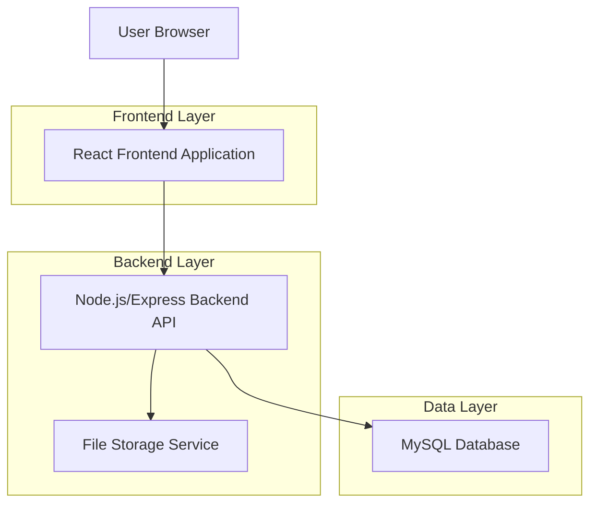
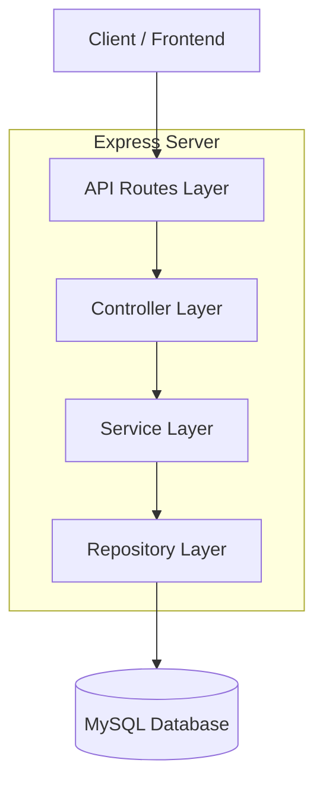
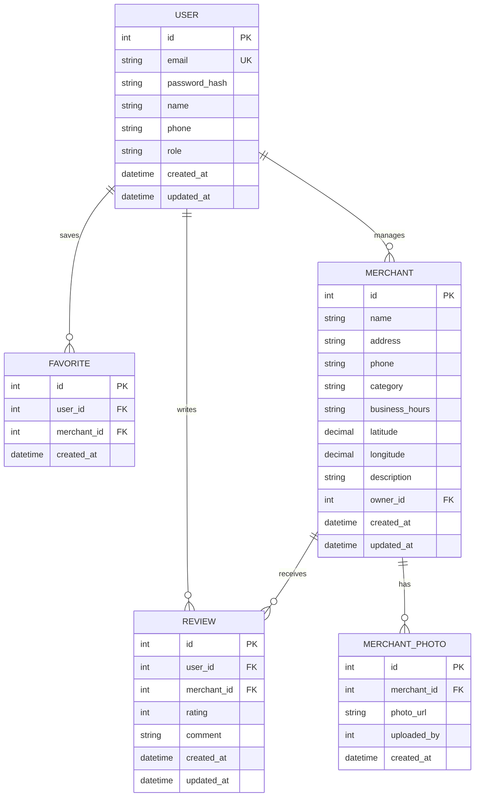

## 1. Architecture design



## 2. Technology Description

- Frontend: React@18 + tailwindcss@3 + vite
- Initialization Tool: vite-init
- Backend: Node.js@18 + Express@4
- Database: MySQL@8
- File Storage: Local file system with multer middleware

## 3. Route definitions

| Route | Purpose |
|-------|---------|
| / | Home page, displays search and merchant listings |
| /search | Search results page with filters |
| /merchant/:id | Merchant detail page with reviews and photos |
| /login | User login page |
| /register | User registration page |
| /profile | User profile and settings |
| /my-reviews | User's review history |
| /favorites | User's favorite merchants |

## 4. API definitions

### 4.1 Authentication APIs

**User Registration**
```
POST /api/auth/register
```

Request:
| Param Name | Param Type | isRequired | Description |
|------------|------------|------------|-------------|
| email | string | true | User email address |
| password | string | true | Password (min 6 characters) |
| name | string | true | User display name |
| phone | string | false | Phone number |

Response:
| Param Name | Param Type | Description |
|------------|------------|-------------|
| success | boolean | Registration status |
| token | string | JWT token for authentication |
| user | object | User data object |

**User Login**
```
POST /api/auth/login
```

Request:
| Param Name | Param Type | isRequired | Description |
|------------|------------|------------|-------------|
| email | string | true | User email address |
| password | string | true | User password |

### 4.2 Merchant APIs

**Get Merchant List**
```
GET /api/merchants
```

Query Parameters:
| Param Name | Param Type | Description |
|------------|------------|-------------|
| page | number | Page number (default: 1) |
| limit | number | Items per page (default: 20) |
| category | string | Filter by category |
| keyword | string | Search keyword |
| location | string | Location filter |

**Get Merchant Details**
```
GET /api/merchants/:id
```

**Create Review**
```
POST /api/merchants/:id/reviews
```

Request:
| Param Name | Param Type | isRequired | Description |
|------------|------------|------------|-------------|
| rating | number | true | Rating 1-5 stars |
| comment | string | true | Review text (max 200 characters) |
| photos | array | false | Array of photo URLs |

### 4.3 File Upload API

**Upload Image**
```
POST /api/upload
```

Request: multipart/form-data with image file

## 5. Server architecture diagram



## 6. Data model

### 6.1 Data model definition



### 6.2 Data Definition Language

**用户表 (users)**
```sql
CREATE TABLE users (
    id INT PRIMARY KEY AUTO_INCREMENT,
    email VARCHAR(255) UNIQUE NOT NULL,
    password_hash VARCHAR(255) NOT NULL,
    name VARCHAR(100) NOT NULL,
    phone VARCHAR(20),
    role ENUM('user', 'merchant_admin', 'admin') DEFAULT 'user',
    created_at TIMESTAMP DEFAULT CURRENT_TIMESTAMP,
    updated_at TIMESTAMP DEFAULT CURRENT_TIMESTAMP ON UPDATE CURRENT_TIMESTAMP
);

CREATE INDEX idx_users_email ON users(email);
CREATE INDEX idx_users_role ON users(role);
```

**商户表 (merchants)**
```sql
CREATE TABLE merchants (
    id INT PRIMARY KEY AUTO_INCREMENT,
    name VARCHAR(200) NOT NULL,
    address VARCHAR(500) NOT NULL,
    phone VARCHAR(20),
    category VARCHAR(50) NOT NULL,
    business_hours VARCHAR(200),
    latitude DECIMAL(10, 8),
    longitude DECIMAL(11, 8),
    description TEXT,
    owner_id INT,
    created_at TIMESTAMP DEFAULT CURRENT_TIMESTAMP,
    updated_at TIMESTAMP DEFAULT CURRENT_TIMESTAMP ON UPDATE CURRENT_TIMESTAMP,
    FOREIGN KEY (owner_id) REFERENCES users(id)
);

CREATE INDEX idx_merchants_category ON merchants(category);
CREATE INDEX idx_merchants_location ON merchants(latitude, longitude);
CREATE FULLTEXT INDEX idx_merchants_search ON merchants(name, address);
```

**评论表 (reviews)**
```sql
CREATE TABLE reviews (
    id INT PRIMARY KEY AUTO_INCREMENT,
    user_id INT NOT NULL,
    merchant_id INT NOT NULL,
    rating TINYINT CHECK (rating >= 1 AND rating <= 5),
    comment VARCHAR(200) NOT NULL,
    created_at TIMESTAMP DEFAULT CURRENT_TIMESTAMP,
    updated_at TIMESTAMP DEFAULT CURRENT_TIMESTAMP ON UPDATE CURRENT_TIMESTAMP,
    FOREIGN KEY (user_id) REFERENCES users(id),
    FOREIGN KEY (merchant_id) REFERENCES merchants(id),
    UNIQUE KEY unique_user_merchant (user_id, merchant_id)
);

CREATE INDEX idx_reviews_merchant ON reviews(merchant_id);
CREATE INDEX idx_reviews_rating ON reviews(rating);
CREATE INDEX idx_reviews_created ON reviews(created_at DESC);
```

**商户照片表 (merchant_photos)**
```sql
CREATE TABLE merchant_photos (
    id INT PRIMARY KEY AUTO_INCREMENT,
    merchant_id INT NOT NULL,
    photo_url VARCHAR(500) NOT NULL,
    uploaded_by INT NOT NULL,
    created_at TIMESTAMP DEFAULT CURRENT_TIMESTAMP,
    FOREIGN KEY (merchant_id) REFERENCES merchants(id),
    FOREIGN KEY (uploaded_by) REFERENCES users(id)
);

CREATE INDEX idx_photos_merchant ON merchant_photos(merchant_id);
```

**收藏表 (favorites)**
```sql
CREATE TABLE favorites (
    id INT PRIMARY KEY AUTO_INCREMENT,
    user_id INT NOT NULL,
    merchant_id INT NOT NULL,
    created_at TIMESTAMP DEFAULT CURRENT_TIMESTAMP,
    FOREIGN KEY (user_id) REFERENCES users(id),
    FOREIGN KEY (merchant_id) REFERENCES merchants(id),
    UNIQUE KEY unique_user_favorite (user_id, merchant_id)
);

CREATE INDEX idx_favorites_user ON favorites(user_id);
```

## 7. Security Considerations

- JWT token authentication with refresh mechanism
- Password hashing using bcrypt with salt rounds of 10
- Rate limiting on API endpoints (100 requests per 15 minutes per IP)
- Input validation and SQL injection prevention
- CORS configuration for cross-origin requests
- File upload restrictions (image types only, max 5MB per file)

## 8. Performance Optimization

- Database indexing on frequently queried fields
- Redis caching for hot data (merchant ratings, popular searches)
- Image compression and CDN integration
- Pagination for large datasets
- Database connection pooling